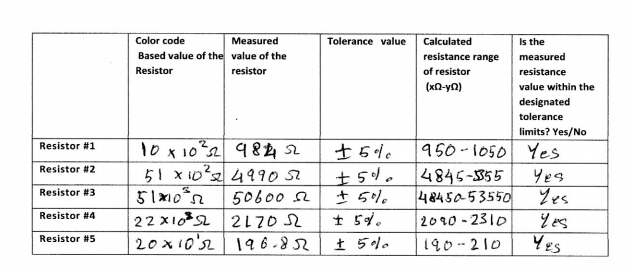
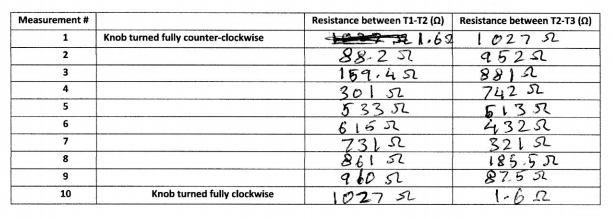

---
output:
  pdf_document: default
  html_document: default
---

\newcommand{\bcenter}{\begin{center}}
\newcommand{\ecenter}{\end{center}}

&nbsp;

&nbsp;

&nbsp;

&nbsp;

&nbsp;

&nbsp;

&nbsp;

&nbsp;

\bcenter

# ECE-LAB-1

## I: Cover Page

### ECE 101-203

#### Lab No.1 – Laboratory 1 - Resistance

#### Name: Eashan Gupta

#### Date 9/7/2020

\ecenter

\newpage

## II: Objectives

To learn how to use a multi-meter and measure resistance with it. To also learn how to read the color codes on resistors and understand how the potentiometer functions.

&nbsp;

&nbsp;

## III: Materials and Objective  

- 1 potentiometer  
- Brown-Black-Red-Gold resistor(1.0kΩ)  
- Red-Red-Red-Gold Resistor(2.2kΩ)  
- Green-Brown-Orange-Gold Resistor(51kΩ)  
- Red-Black-Brown-Gold Resistor(200Ω)  
- Green-Brown-Red-Gold Resistor(5.1kΩ)  
- Two banana to alligator plug wires (one red one black)  
- Multi-meter  
- Potentiometer adjustment tool  

&nbsp;

&nbsp;

## IV: Circuit Simulations

## V: Laboratory Data

 &nbsp;

&nbsp;

&nbsp;

The table above shows the data that was collected from each of the resistors using the alligator clips connected to each end of the resistor, and the multi-meter. The first column shows the calculated value of the resistor based on the color bands on it. The second column shows the experimental value of the resisitor obtained by using the multimeter. Column 3 is for the 4th strip in the resistor which is the tolerence value. The fourth column represents the range of the resistance. This is calculater by finding out what 5 percent of the color band resistance value is and then subtracting and adding the derived value to it. The last column is used the note whether the experimental value is within the calculated range in column 4.  

&nbsp;

&nbsp;

&nbsp;

This table demonstrates the relation of the resistance between T1 - T2 and T2 - T3. After connecting the alligator clips to T1 and T2 each and turning the knob fully counter clockwise the value for the resistance on the multimeter will read 1.6 ohms. Now without spinning the knob simply removing the alligator clip from T1 and attaching it to T3 will make the multimeter display a value of 1027 ohms. Now, by slowly spinning the knob clockwise it is noticed that the value of the resistance between T1 and T3 decreases as the knob spins. After the knob is spun a small amount and the value of the resistance between T2 - T3 has slightly decreased, when the alligator clip on T3 is connected back to T1 it is noticed that the value of the resistance between T1 - T3 has slightly increased as read on the multimeter. This process is repeated multiple times to draft the table above. When the knob was tunred counter clockwise the table displayed the max value for the resistance between T2 and T3 and the min value between T1 and T2 and vice versa for clockwise.

&nbsp;

&nbsp;

## VI: Theoretical vs Experimental Data

The Theoretical data for the resisitors was derived using the color bands on the resistors. For a 4 band resistor the first band represents the first number, the second band represents the second number, the third band represents the number gotten from the first 2 bands times 10^(number based on color of the bands), and the fourth band is the tolerence. So the output will be in the terms of AB * 10^C +-D% with each letter representing a value derived from each of the colored bands from first to last. We used this method to derive the expected/theoretical value of each resistor.  

Based on the discussion and lecture in class it was expected that in part 1 the experimental value of the resistor would be similar to the calculated value of the resistor. For all the resisitors the experimental value was within the calculated range of the which was the expected result. For part 1 of the lab the theoretical data matches the result that we got after experimentation. In part 2 based on the theoretical data it was expected that as the knob is spun clockwise the resistance between T1 and T2 will increase and the resistance between T2 and T3 will decrease. After testing with the multimeter and alligator clips on an actual potentiometer it was determined that this holds true. As one increased the other decreased. In part 2 of the lab as well the theoretical data matches the experimental data. 

&nbsp;

&nbsp;

## VII: Conclusions and Comments

From the observations made from the theoretical data and the Experimental data and how they relate with each other is is safe to say that the results of this lab could be predicted and in fact were predicted and correct. It is safe to say that when using resisitors the color bands can be used to calculate the resistors value for projects, but it would still be recommended to use a multimeter in cases where accuracy is crucial. We are also able to conclude that the potentiometer is functional and works as desired. The experimental data for the potentiometer too matches the experimental data. Through the experiment it was confirmed that what was thought in class about resistors and potentiometers was indeed correct because it matched the experimental data.

&nbsp;

&nbsp;

## IX: Answers to Questions

1. The tolerence shows how likely it is for the actual resistence of the resistor to be close to the calculated value. Some operations require very precise resistence which is why in those cases a resisitor with very low resistence would be preferred. The tolerence is a way to let the people using the resistor know how much their actual resistence value may deviate from the calculated value.

2. 5 band resistors would be used when we want resistors with higher resistence than that of which a 4 band resistor can offer. A 5 band resistor has an extra digit in it thus allowing us to be more precise and larger with our resistence values. A 2 band resistor can't have a resistence value of 265 based off calculation but a 3 band can making it more precise.

3. A 6 band resistor adds the measurement of temperature to the resistor. A 6 band resistor is used when the temperature of the surroundings has to be taken into account. This would likely be used at rather cold locations or hotter places (non room temperature locations).

4. No question 4

5. The max resistence of the potentiometer is 1027 ohms

6. The last 2 columns display the relationship between the resistence between T1 - T2 and T2 - T3. They both add up to about 1027 ohms. As one increases the other decreases.

7. It can be used as a variable resistor or can be used in place of a resistor to get an accurate resistence by just spinning the knob.

