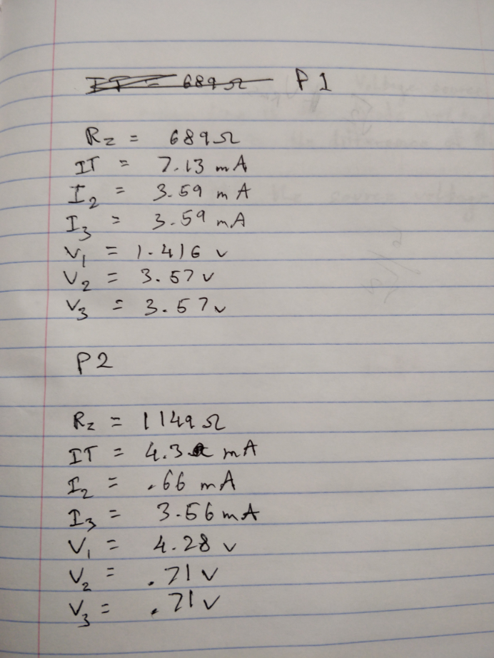

---
output:
  pdf_document: default
  html_document: default
---

\newcommand{\bcenter}{\begin{center}}
\newcommand{\ecenter}{\end{center}}

&nbsp;

&nbsp;

&nbsp;

&nbsp;

&nbsp;

&nbsp;

&nbsp;

&nbsp;

\bcenter

# ECE-LAB-1

## I: Cover Page

### ECE 101-203

#### Lab No.2 – Laboratory 3 - Combination Series/Parallel Circuits 

#### Name: Eashan Gupta

#### Date 9/23/2020

\ecenter

\newpage

## II: Objectives

To learn how circuits with a combination of series and parallel resistors work and how to measure the values in the circuit.

&nbsp;

&nbsp;

## III: Materials and Equipment  

- 1 potentiometer  
- Brown-Black-Red-Gold resistor(1.0kΩ) 2x
- Red-Black-Brown-Gold Resistor(200Ω) 
- Analog Discovery 2  
- Two banana to alligator plug wires (one red one black)  
- Multi-meter  
- Breadboard  
- Wire Jumper  
- AD2 pin array

&nbsp;

&nbsp;

## IV: Circuit Simulations

\bcenter
two 1k ohm in series 200 ohm
\ecenter

&nbsp;

&nbsp;

\bcenter
200ohm and 1k ohm in parallel, in series with 1k ohm
\ecenter

\newpage

## V: Laboratory Data

 &nbsp;

&nbsp;

&nbsp;

This table shows the experimental values for both part 1 and part 2 of the lab. In part 1 there are two 1k ohm resistors in parallel that are in series with a 200 ohm resistor. A multimeter is used to find the equivalent resistance in the circuit. The multimeter is then placed in series with each resistor one by one to find the current in the circuit at each resistor. Following this the multimeter is then placed in parallel with each resistor to find the voltage drop across each resistor.

In part 2 of the lab the second 1k ohm resistor is replaced with the 200 ohm resistor. The same process from part 1 is repeated in part 2 to derive values for the equivalent resistance, current, and voltage.

&nbsp;

&nbsp;

## VI: Theoretical vs Experimental Data

Theoretically it is expected that using kirchoffs loop law the voltage will be divided between the 200 ohm resistor and the req of the 2 resistors in parallel based on the ratios of the resistance. The two 1k ohm resistors which are in parallel then have equal voltage. This matches the experimental value as v1 is based of the ratio of r1:r23. Also v2 = v3 as expected. The I is expected to be divided based on the resistance of the resistance and the voltage drop across each resistor. V = IR. And the experimental value is in accordance with the theoretical value. This is again seen in part 2 where in this case the 2 resistors in parallel are different resistance but the voltage is still the same. The same holds for KCL as the current distribution was as expected

&nbsp;

&nbsp;

## VII: Conclusions and Comments

The theoretical data matches the experimental data which was expected. It was verified that KCL and KVL hold true in a combination circuit too. We were able to create the circuit on circuit lab and through pur experiments it was clear that the data from the experiments matches that of circuitlab. If any limitations then there is underlying resistance in the wires which slightly affect the voltage.
&nbsp;

&nbsp;

## VIII: Answers to Questions

1. The voltage drop across the resistor  divided by the current flowing through it equals the resistance of the resistor. (V/I = R)

2. As the voltage increases the resistance increases, whereas as the current increases the resistance decreases

3. Yes this experiment does verify Ohm's law because Ohms law states that I = V/R and in this experiment we can see the same relationship between Resistance, Current and Voltage. In our experiment the voltage divided by the current consistently was similar to the actual resistance.

4. Yes, there were slight differences of .01 volts between the source voltage and the resistance drop across the resistor. The reason for the difference in voltage drop across the resistor and the source voltage could be because of the resistance in the wire.

5. The sum of V1 and V2 is equal to the source voltage in both parts.

6. Based on Kirchoff's Voltage law the sum of the voltage drop across resistors in a series will be equal to the source voltage. We can see in this case that that holds true as the sum of V1 and V2 in both cases does equal the source voltage.

7. 
Vs/I = Req
V1/I = R1
V2/I = R3

R1 + R3 = Req

We can see a clear relation between the resistance of the resistor and the voltage drop across the resistor. The voltage drop across the resistors is in proportion with the resistance of the resistor when in series.

8. The resistor would be 3.2k ohms

9. I2 + I3 is equal to I in both parts b and c

10. V1 and V2 are equal to the source voltage in both parts

11. Kirchoff's current law states that at a junction the current in will be equal to the current out. Also, current will be divided in a parallel circuit. In this experiment we can see that the current that enters the junction is equal to the current that leaves the junction thus following Kirchoff's current law.

12. I1xR1 is equal to the voltage across resistor 1 and I2xR2 is equal to Voltage across R2 

13. 687.5 Ohm resistor

