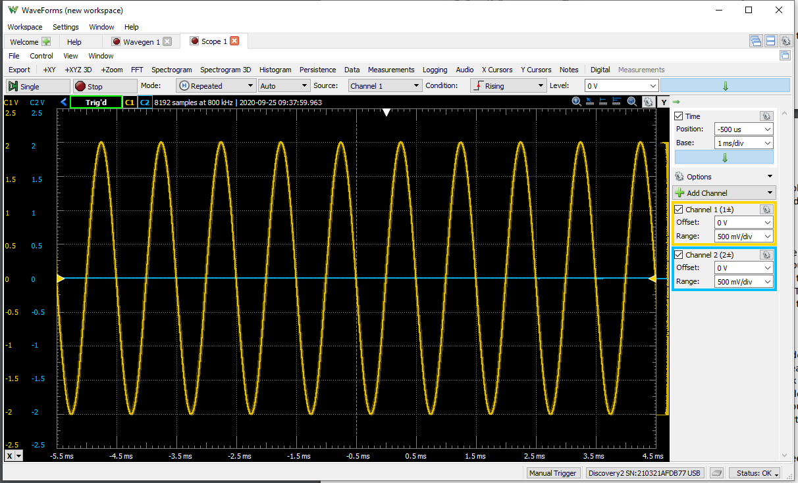
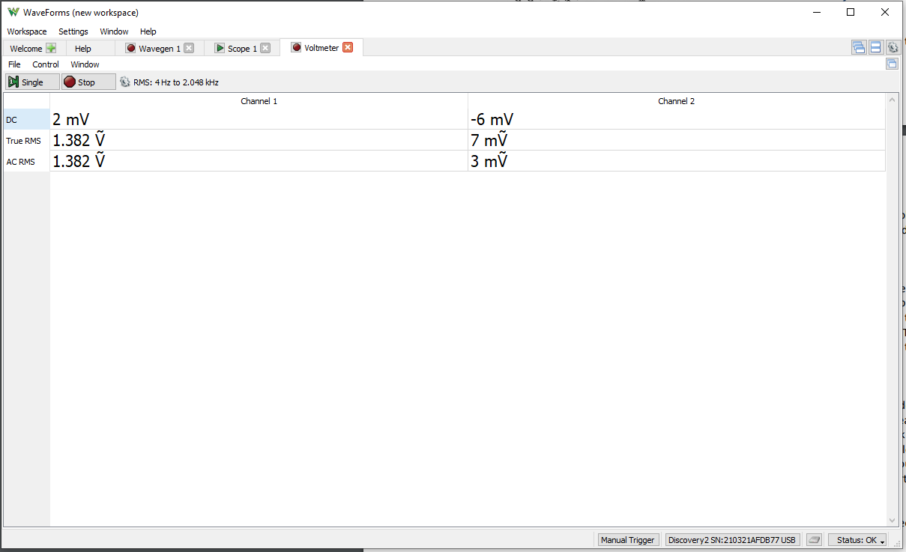
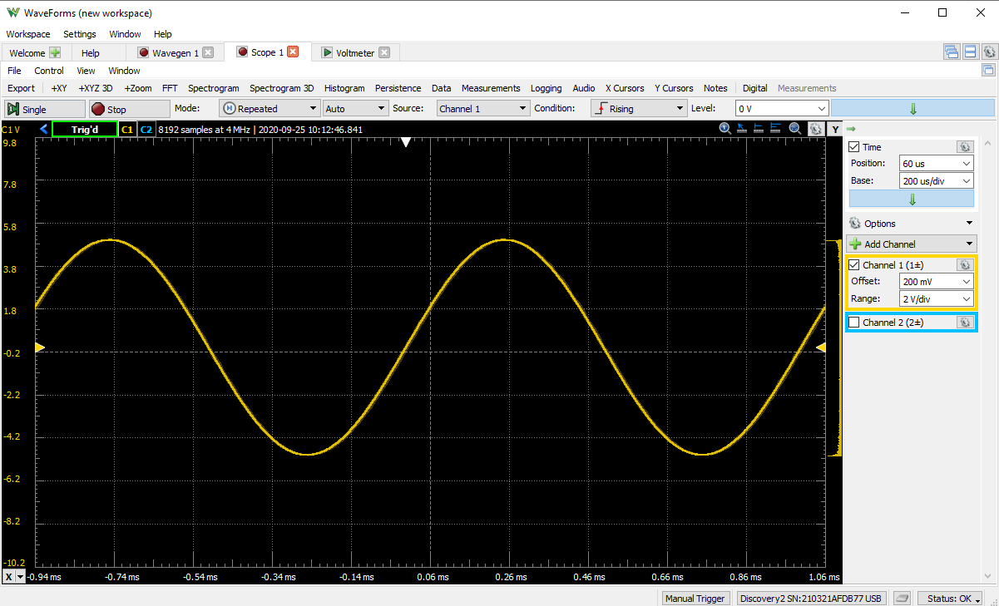
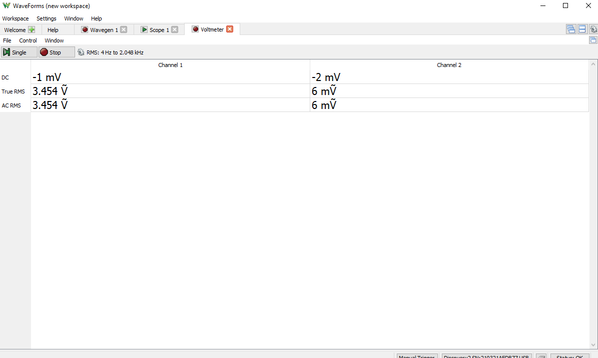
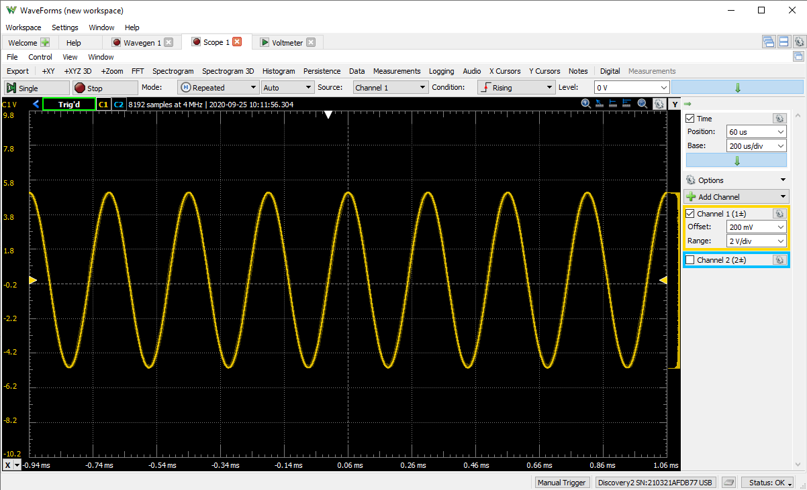
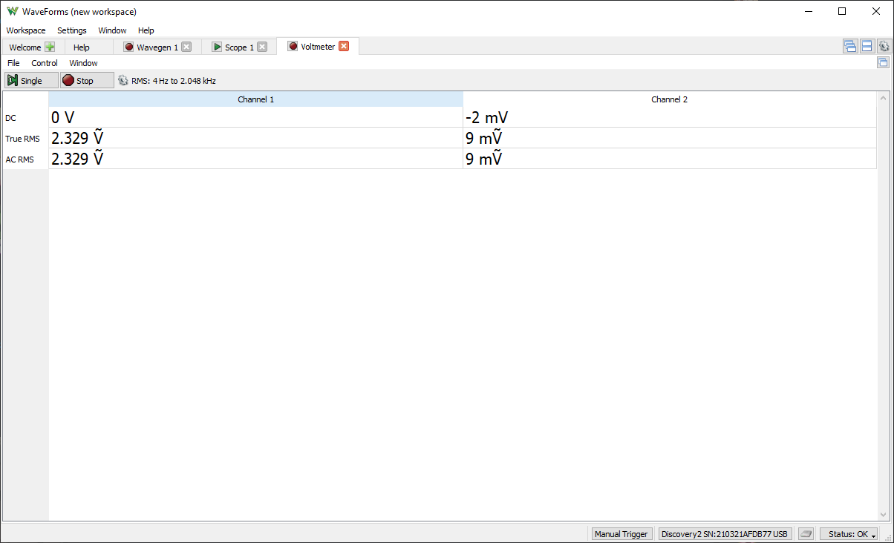
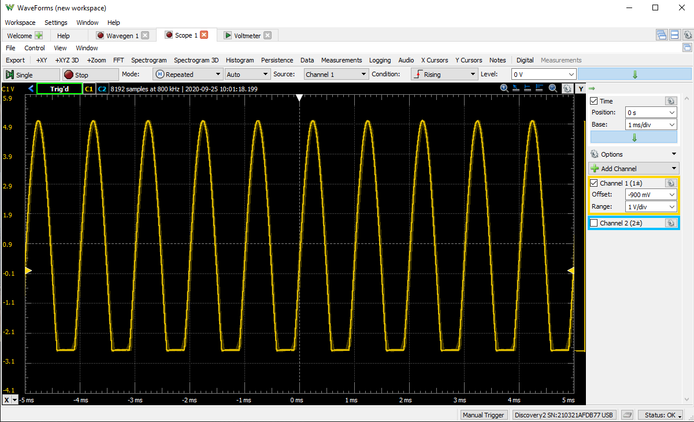
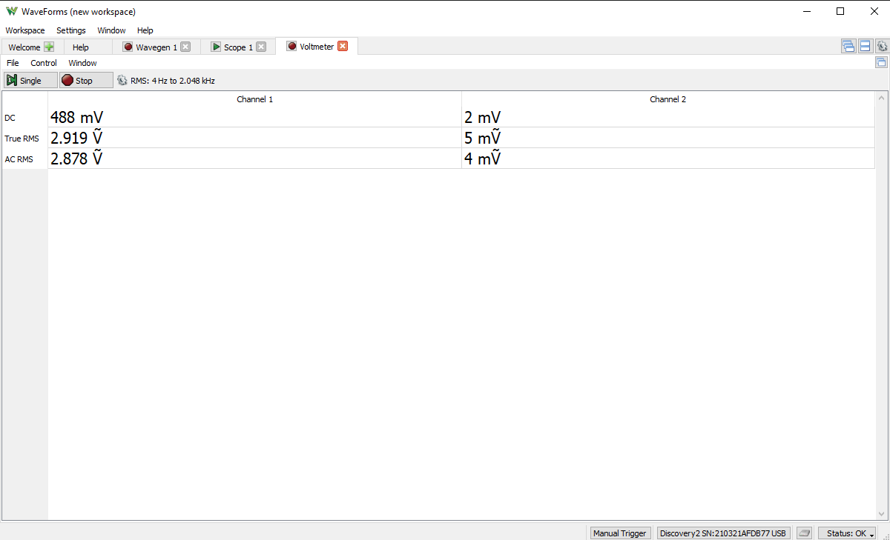
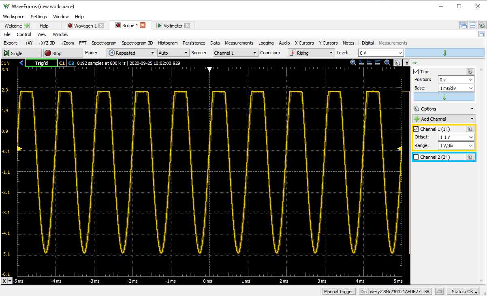
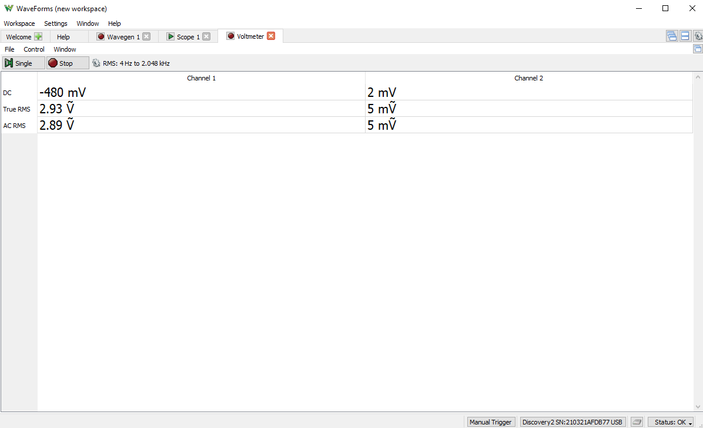

---
output:
  pdf_document: default
  html_document: default
---

\newcommand{\bcenter}{\begin{center}}
\newcommand{\ecenter}{\end{center}}

&nbsp;

&nbsp;

&nbsp;

&nbsp;

&nbsp;

&nbsp;

&nbsp;

&nbsp;

\bcenter

# ECE-LAB-1

## I: Cover Page

### ECE 101-203

#### Lab No.5 – Laboratory 5 - Introduction to the Function Generator and Oscilloscope  

#### Name: Eashan Gupta

#### Date 10/23/2020

\ecenter

\newpage

## II: Objectives

The purpose of the lab is to learn how to use the function generator to generate sin waves of varying amplitude and frequency and also to learn how to dislplay the generated signals using an oscilloscope. The lab also teaches the about the functionality of LED's.

&nbsp;

&nbsp;

## III: Materials and Equipment  

- Push button switch  
- Brown-Black-Red-Gold resistor(1.0kΩ)
- Red-Black-Brown-Gold Resistor(200Ω) 
- 2 LEDs any color  
- Analog Discovery 2  
- Computer  
- Two banana to alligator plug wires (one red one black)  
- Multi-meter  
- Breadboard  
- Wire Jumper  

&nbsp;

&nbsp;

## IV: Circuit Simulations

## V: Laboratory Data

&nbsp;

&nbsp;

\bcenter
Sine wave and voltage drop across resistor
\ecenter

&nbsp;

&nbsp;

\bcenter
Sine wave with 5 volts being applied and the voltage drop
\ecenter

&nbsp;

&nbsp;

\bcenter
Sine wave with 5 volts and frequency 4KHz being applied and the voltage drop
\ecenter

&nbsp;

&nbsp;

\bcenter
Sine wave with led one way and opposite way as well as the voltage drop
\ecenter
\newpage

## VI: Theoretical vs Experimental Data

Theoretically it is expected that the when the voltage is incresed the amplitude of the sine wave will increase and this can be noticed to be true in the generated sine wave on the the waveforms function. We see in Part C and D that when the voltage is increased the voltage drop across the resistor is increased and the amplitude of the sine wave is also increased, as expected from the theoretical data. Theoretically it is expected that when the hertz increases the period will decrease as period is equal to one/hertz. When we generate the sine wave we notice that in part e when the hertz is increased to 4KHz that the period is decreased, thus holding true with our theoretical data. 

In part 2 when the led is placed in a forward bias it is expected that the there will be a voltage drop when the voltage reaches a negative max. This can be observed to be true in the waveforms software as it is clear that the when v in the wave is below 0 it is different than when there is no diode. The voltage doesn't have the same peak in the negative side as in the positive side. This is because of the foward voltage of the diode which is expected. Thus we can say that the theoretical data matches the experimental data in this case. This is also the same for the when the diode is in reverse bias as in this case the graph is flipped over the y axis and it is expected.

&nbsp;

&nbsp;

## VII: Conclusions and Comments

It was noticed that in all the tests the theoretical data matched the experimental data as expected. There may have been accuracy errors in the data as there could have been underlying resistor and wire resistance. 

&nbsp;

## VIII: Answers to Questions

1. As the amplitude is increased the graph stretches vertically and the peak voltage increases.

2. Vrms = Vpeak/sqrt(2), When the v = 2, Vrms = 1.414v. When the v = 5, the Vrms = 3.536.
Vavg = pi/2 * Vp, When the v = 2, Vavg = 3.142. When the v = 5, the Vavg = 7.854.

To measure it with the AD2 we have to connect it to the channel, the Vrms for 2v is 1.402 and for 5v is 3.523
 
3. The graph is squeezed horizontally and the period decreases.

4. Frequency is the number of repetitions the sin wave completes in a second. We can look at the sine wave and look at the amount of time it takes to complete one cycle and then divide that by one to get the frequency.

5. Yes, the led is lit when it is both ways. This is because the voltage being applied is higher than the led's max forward voltage. 

6. When the button is pressed the switch is closed and LED2 starts to glow. Yes it is different from part a.

7. The led is now blinking. This is because the frequency is very low. So when the led is placed in forward and the voltage is positive the led will glow and then when the sine wave voltage goes to neagative the led will stop glowing.
